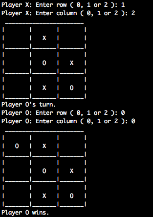
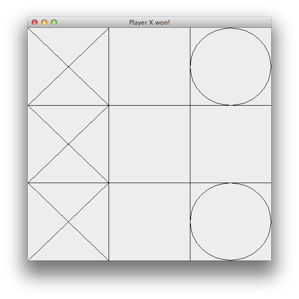

# Java Tic-Tac-Toe

A pseudo Model View Controller approach was taken in this program.  Inside the the file `PlayTicTacToe.java`, the lines `18-19` can be toggled to produce either a command line version of the program or a graphical.

## Running

1. Download and decompress files.
2. Open a terminal application and change to the projects directory.
3. Execute a `make` command.
4. If you wish to run the command line version, comment out the line `19` and uncomment out line `18` and goto step 3.

## Screenshots

